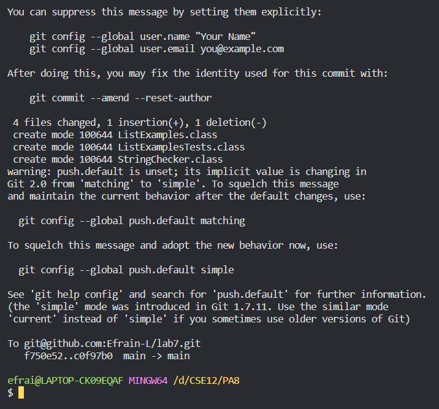

# Lab Report 5
## Revisiting Lab Report 4
### Completing the tasks using a script

For this lab report, I decided to revisit the fourth Lab report, in which we were given tasks to complete as fast as possible. Instead of writing/entering commands manually, I have written a bash script that will complete the tasks in seconds.

The script I wrote is called `task.sh` and contains the following shell commands:

```sh
rm -rf lab7/
git clone $1
cd lab7/
javac -cp .:lib/hamcrest-core-1.3.jar:lib/junit-4.13.2.jar *.java
java -cp .:lib/hamcrest-core-1.3.jar:lib/junit-4.13.2.jar org.junit.runner.JUnitCore ListExamplesTests
sed -i '43 s/index1/index2/' ListExamples.java
javac -cp .:lib/hamcrest-core-1.3.jar:lib/junit-4.13.2.jar *.java
java -cp .:lib/hamcrest-core-1.3.jar:lib/junit-4.13.2.jar org.junit.runner.JUnitCore ListExamplesTests
git add *
git commit -m "SCRIPTED"
git push
```

Going through the script one command at a time, starting with the first line:
* `rm -rf lab7/` This command will delete the lab7 directory if it already exists. This is useful for clearing the directory to be cloned again from previous attempts.
* `git clone $1` This command will clone the repository, which is entered to the script as a command line argument, and used in the script as `$1`.
* `cd lab7/` Changing directory to the newly cloned lab7 directory
* `javac -cp .:lib/hamcrest-core-1.3.jar:lib/junit-4.13.2.jar *.java` Compiling the JUnit tests
* `java -cp .:lib/hamcrest-core-1.3.jar:lib/junit-4.13.2.jar org.junit.runner.JUnitCore ListExamplesTests` At this point in the script, running the JUnit tests with this command will result in one of the tests failing. Later in the script the bug causing that test to fail will be fixed.
* `sed -i '43 s/index1/index2/' ListExamples.java` This line is using the `sed` command, which stands for stream editor, and is used for making changes to files through a command. Here I am using the `-i` option, which will make changes "inplace" meaning that the changes made will be saved to the file. In single quotes I have `43`, which is the line number I want to modify, `s/index1/index2` is the pattern I am using to make changes, what it does is look in that line for the occurence of `index1` and changes it to `index2`. This then fixes the bug in the code (source for sed: [https://www.geeksforgeeks.org/sed-command-in-linux-unix-with-examples/](https://www.geeksforgeeks.org/sed-command-in-linux-unix-with-examples/)).
* Then in the following two commands, I rerun the JUnit test commands again, first compiling and then running ListExamplesTests with JUnit. This time however, the output shows that the tests pass since the bug has been fixed.
* `git add *` Here I am using a git command to add all changes to the next commit
* `git commit -m "SCRIPTED"` Then I commit those changes with the message "SCRIPTED" to show that it was the script that made this commit.
* `git push` Finally, the script pushed those changes to the remote repository on Github.

In order to actually run the script, after having forked the repository and copying the forked repository's SSH clone link, I run the following command on my local machine:
```sh
ssh cs15lwi23atv@ieng6.ucsd.edu 'bash -s' < ./task.sh git@github.com:Efrain-L/lab7.git
```
* How this command works is that, it will log in to my ieng6 course account through ssh, and the `'bash -s'` part of the command will then execute a bash command with the `-s` option, which helps with reading the executable command with standard input. Then `<` followed by the script file `task.sh` which is in my current local directory, and the SSH clone link for the respository passed as an argument. (source: [https://www.baeldung.com/linux/run-shell-script-remote-ssh](https://www.baeldung.com/linux/run-shell-script-remote-ssh)

**Finally, here are some screenshots of the process:**




**And the results of the before and after of making the commits and pushing to the repository.**


