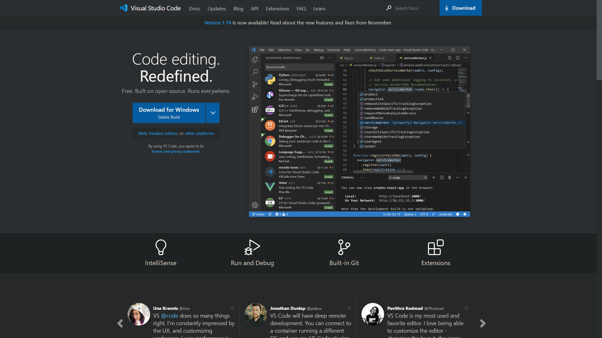
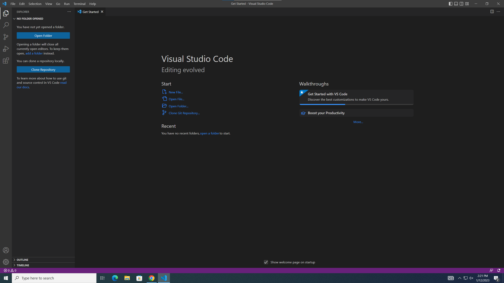
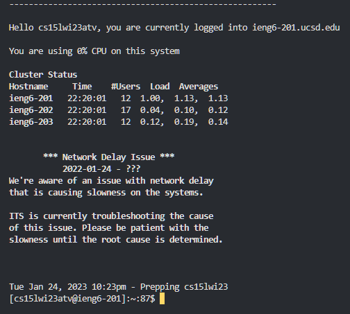
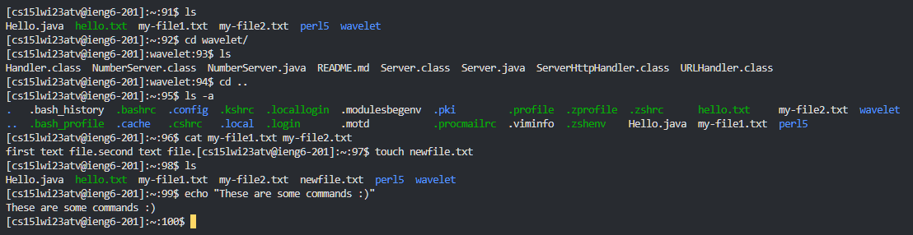

# CSE15L Week 1 Lab Report
## Tutorial on logging into an ieng6 account via VSCode.
> ***Step 1***
> 
> Installing VSCode
> * You should first and foremost download and install VSCode using this link: https://code.visualstudio.com/. 
> * Ensure that you download the correct version for the operating system you currently have running on your computer. For example, my computer is running Windows 11; therefore on the download page I clicked the "Download for Windows" button as seen here:

> * For other operating systems, you should click on the smaller link directly below labeled "other platforms" which will then show download options for additional operating systems like Linux or MacOS.
> * Then, after running through the installation and setup process, opening VS Code should result in a page which looks like this image below.


> ***Step 2***
> 
> Next, we will want to connect remotely to the ieng6 account.
> * To get started, first we will open a terminal in VSCode. This can be done using the short-cut **ctrl-\`**
> * Before typing commands, ensure that the git bash terminal is selected rather than powershell, this will allow for the use of bash commands.
> * Next, type the following command, where the **zz** is replaced with the characters from your course-specific account.
```
$ ssh cs15lwi23zz@ieng6.ucsd.edu
```
> * Entering this command will prompt for a password. Enter your password and hit enter.
> NOTE: The password will be hidden in the terminal and it will look like you are not typing anything, so continue typing your password as normal.
> After completing these steps, you should be greeted with a log in message in the terminal as shown below:



> ***Step 3***
> * Now you are logged in and you can try some commands!
> * Here are a few commands that I have entered to show you as examples.

> ***A quick description of what each command does:***
> * The ```ls``` command will list all files and directories in the current working directory, and the ```-a``` flag will list all files including hidden files. The ```cd``` command will change the current working directory to the path given. ```cat``` will concatenate and print the contents of one or more files. The ```touch``` command will create a new file with the given name. Finally, the ```echo``` command will display text from the string passed as an argument.

