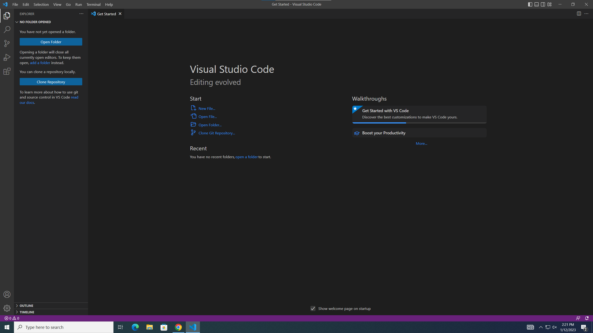
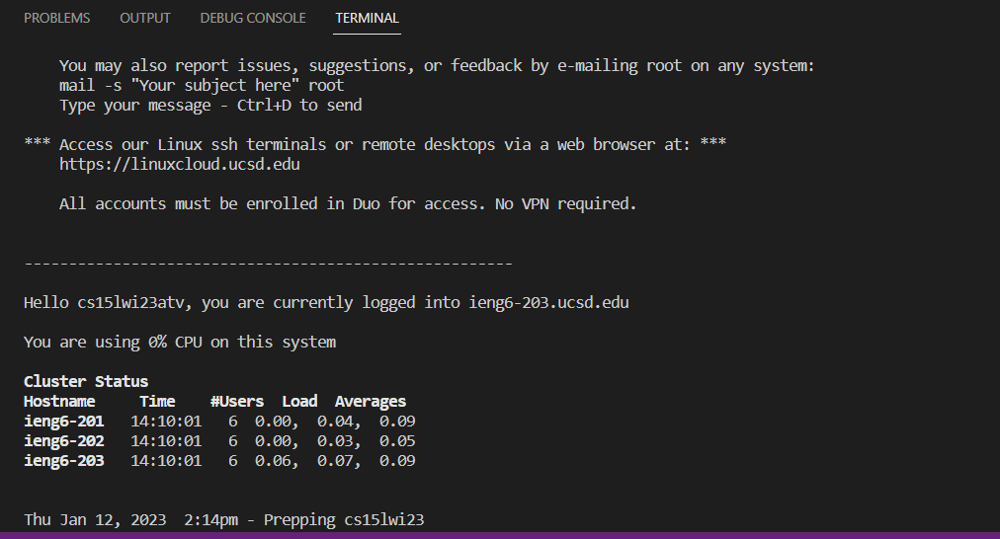
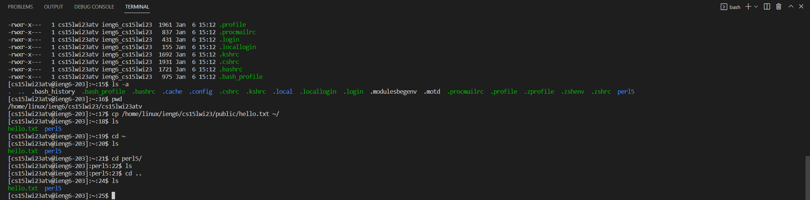

# CSE15L Week 1 Lab Report
## Tutorial on logging into an ieng6 account via VSCode.
> ***Step 1***
> 
> Installing VSCode
> * You should install VSCode for the operating system that you currently have running on your computer. VSCode can be downloded from this link: https://code.visualstudio.com/
> * Then, after going through the installation process, your VSCode should look like this afterwards.


> ***Step 2***
> 
> Next, we will want to connect remotely to the ieng6 account.
> * To get started, first we will open a terminal in VSCode. This can be done using the short-cut **ctrl-\`**
> * Before typing commands, ensure that the git bash terminal is selected rather than powershell, this will allow for the use of bash commands.
> * Next, type the following command, where the **zz** is replaced with the characters from your course-specific account.
```
$ ssh cs15lwi23zz@ieng6.ucsd.edu
```
> * Entering this command will prompt for a password. Enter your password and hit enter.
> NOTE: The password will be hidden in the terminal and it will look like you are not typing anything, so continue typing your password as normal.
> After completing these steps, the terminal should look like this:


> ***Step 3***
> * Now you are logged in and you can try some commands!
> * Here are some random commands that I have entered to show you as examples.


